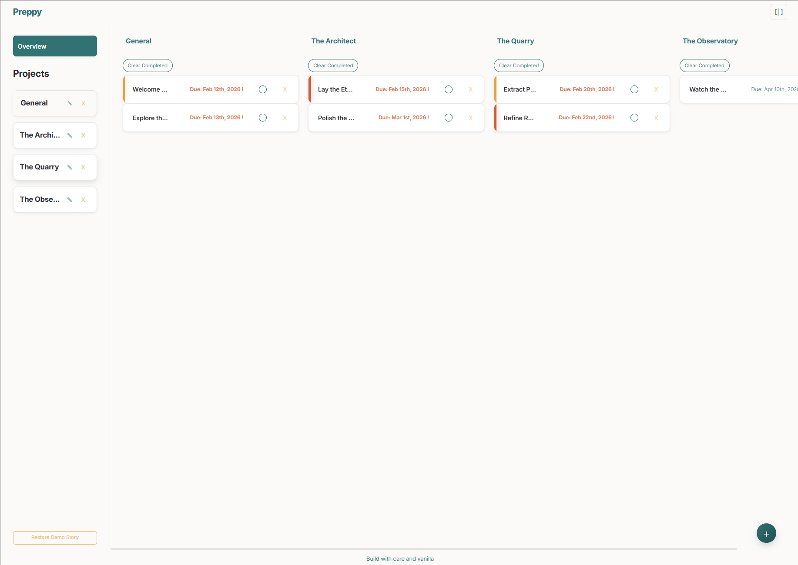

# 📋 Todo List - The Odin Project

A dynamic, modular Task Management application built with Vanilla JavaScript and Webpack. This project focuses on object-oriented programming, module separation, and a professional development workflow.


## 🚀 Live Demo

[Check out the live site here!](https://cmatsagka.github.io/todo-list/)



---

## ✨ Features

- **Project Organization**: Group your tasks into specific projects (Home, Work, etc.).
- **Dynamic Task Creation**: Add titles, descriptions, and due dates.
- **Priority System**: Visual indicators for Low, Medium, and High priority tasks.
- **Smart Dates**: Integration with `date-fns` for formatted due dates and overdue task detection.
- **Persistence**: Your tasks stay saved even if you refresh the page (LocalStorage).
- **Responsive UI**: Clean, modern sidebar layout designed for desktop and mobile.

---

## 🛠️ Built With

- **JavaScript (ES6+)** - Modular architecture.
- **Webpack** - For bundling assets and managing dependencies.
- **date-fns** - Lightweight library for advanced date manipulation.
- **HTML5/CSS3** - Custom styles with CSS Variables for easy maintenance.

---

## 💡 Lessons Learned

- **Module Pattern**: I learned how to separate my application logic (creating todos and projects) from the DOM manipulation code. This made the code much easier to debug.
- **LocalStorage**: I implemented data persistence, which taught me how to serialize complex objects into JSON and retrieve them on page load.
- **Webpack Configuration**: I gained hands-on experience setting up loaders for CSS and assets, moving away from simple `<script>` tags to a modern build process.

---

## 🔧 Developer Workflow

This project uses professional-grade tooling to ensure code quality:

### Installation

1. Clone the repository:

    ```bash
    git clone https://github.com/cmatsagka/todo-list.git
    ```

2. Install dependencies:

    ```bash
    npm install
    ```

3. Start the dev server:

    ```bash
    npm start
    ```

### Linting & Formatting

- **Linting**: Check for logical errors and unused code.

    ```bash
    npm run lint
    ```

- **Formatting**: Auto-format code to match the project style.

    ```bash
    npm run format
    ```

- **Build**: Prepare the project for deployment.

    ```bash
    npm run build
    ```

---

## 🚀 Future Improvements

- Add a "Dark Mode" toggle using CSS variables.
- Implement "Drag and Drop" functionality to reorder tasks.
- Add a search bar to filter tasks by name or description.
